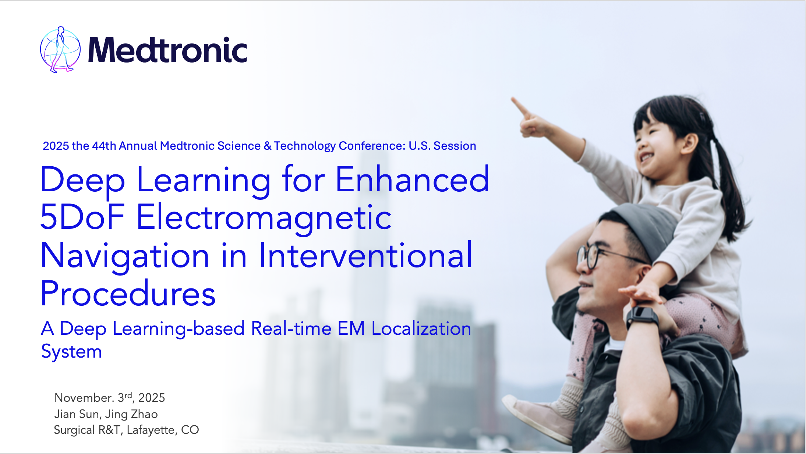

This work is accepted to give an oral presentation at Medtronic S&T 2025 on November 3, 2025. When I get permission, I will disclose the entire slide.

**View poster here**


[**View poster here**](../images/ST2025.png "EM Localization Slide Cover")

